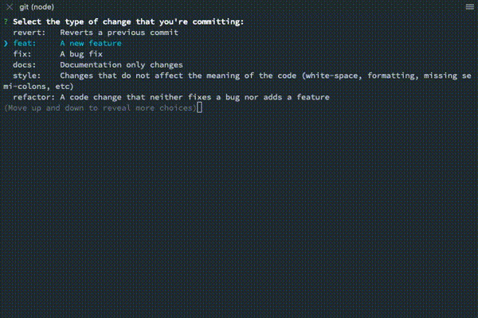

# cz-conventional-changelog-with-jiraid-detection

[](https://www.npmjs.org/package/cz-conventional-changelog-with-jiraid-detection)


A fork of [cz-conventional-changelog-with-jiraid-detection
](https://github.com/DawChihLiou/cz-conventional-changelog-with-jiraid-detection) which is in turn a fork of [cz-conventional-changelog](https://github.com/commitizen/cz-conventional-changelog).

Prompts for conventional changelog standard with an extra step to insert Jira ID. Jira ID is auto-detected from your branch name by default.



Jira ID in the format of `/^[a-zA-Z0-9]+-[0-9]+\$/`, "ADR-123" (or "adr-123") for example, will be automatically detected from the current branch name and be displayed as default at the prompt step. The step is optional so you can skip it if you do not have a Jira ID.

## Install

with npm

```npm install --save-dev @3zs4insomnia/cz-conventional-changelog-with-jiraid-detection```

or with yarn

```yarn add --dev @zs4insomnia/cz-conventional-changelog-with-jiraid-detection```

To enable it, please update your `package.config` as the following

```json5
"config": {
    "commitizen": {
      "path": "./node_modules/@3zs4insomnia/cz-conventional-changelog-with-jiraid-detection"
    }
  },
```

## Features

- 🔥 It works with [semantic-release](https://semantic-release.gitbook.io/semantic-release/) and [Standard Version](https://github.com/conventional-changelog/standard-version) right out of the box.
- 💚 It share the same configurtion with [commitlint](https://github.com/conventional-changelog/commitlint)'s default configuration.
- 💆‍♀️ It prompts an optional step for inserting your Jira ID.
- 🤖 It automatically detects Jira ID from your current branch name and display it as default value at the prompt step.
- 📝 Jira ID is composed into the top of your commit message body.


## Configuration

### package.json

Like commitizen, you specify the configuration of cz-conventional-changelog through the package.json's `config.commitizen` key.

```json5
{
// ...  default values
    "config": {
        "commitizen": {
            "path": "./node_modules/cz-conventional-changelog",
            "disableScopeLowerCase": false,
            "disableSubjectLowerCase": false,
            "maxHeaderWidth": 100,
            "maxLineWidth": 100,
            "defaultType": "",
            "defaultScope": "",
            "defaultSubject": "",
            "defaultBody": "",
            "defaultIssues": "",
            "types": {
              ...
              "feat": {
                "description": "A new feature",
                "title": "Features"
              },
              ...
            }
        }
    }
// ...
}
```

### Environment variables

The following environment variables can be used to override any default configuration or package.json based configuration.

- CZ_TYPE = defaultType
- CZ_SCOPE = defaultScope
- CZ_SUBJECT = defaultSubject
- CZ_BODY = defaultBody
- CZ_MAX_HEADER_WIDTH = maxHeaderWidth
- CZ_MAX_LINE_WIDTH = maxLineWidth

### Commitlint

If using the [commitlint](https://github.com/conventional-changelog/commitlint) js library, the "maxHeaderWidth" configuration property will default to the configuration of the "header-max-length" rule instead of the hard coded value of 100. This can be ovewritten by setting the 'maxHeaderWidth' configuration in package.json or the CZ_MAX_HEADER_WIDTH environment variable.
